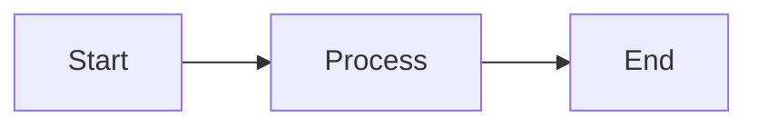
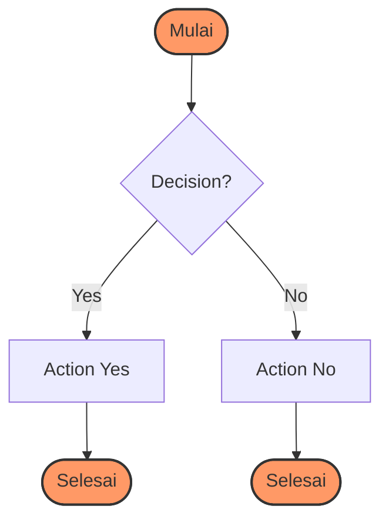
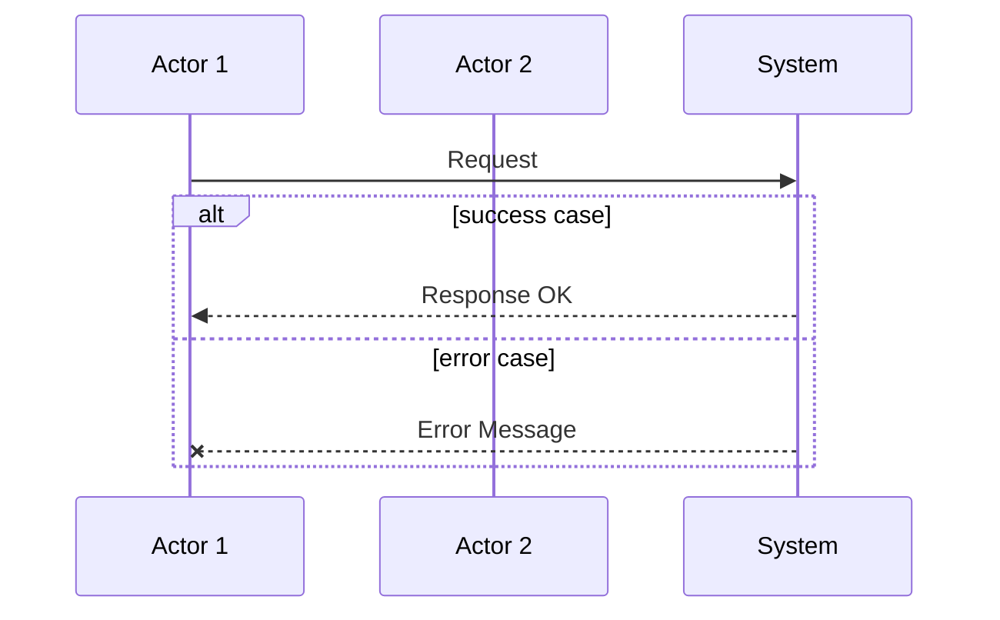
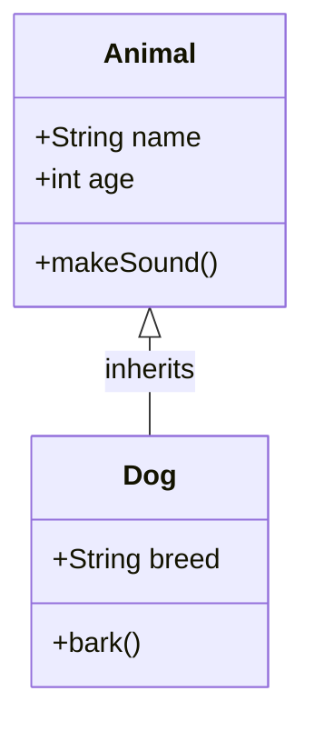
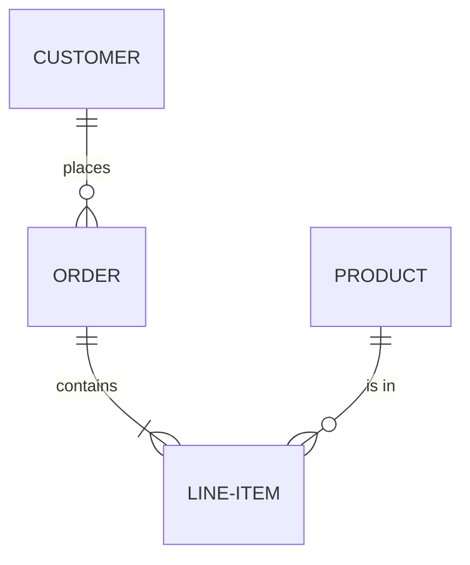
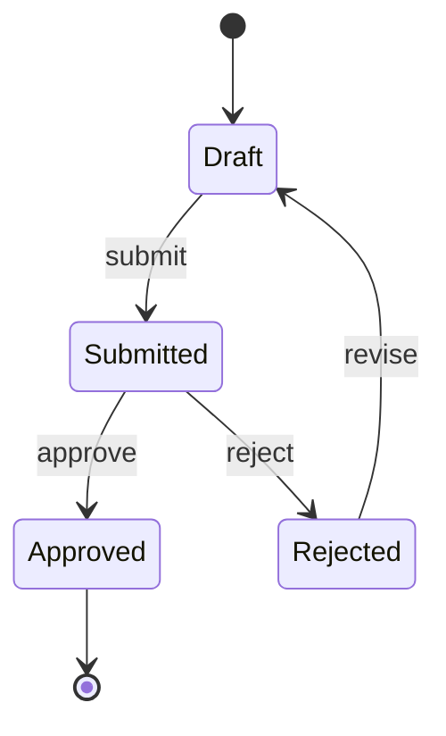
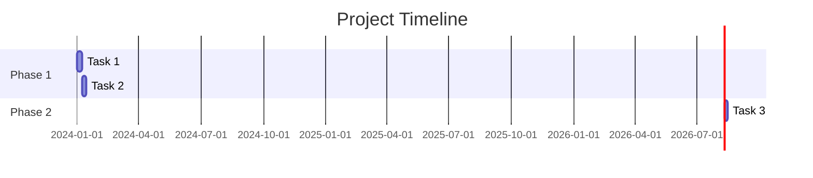
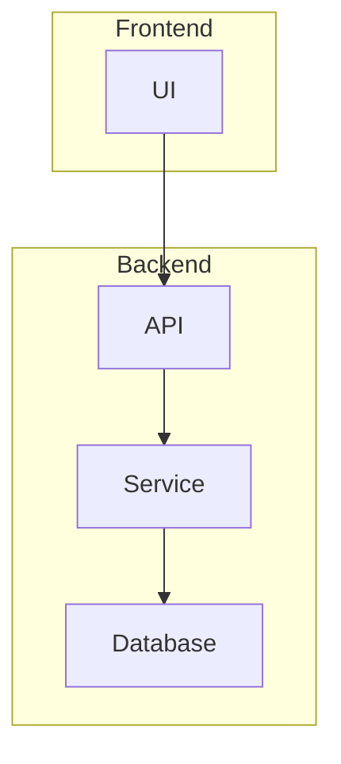
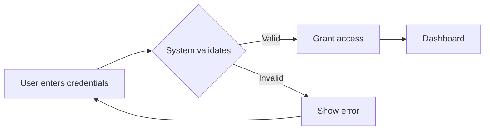

# Mermaid Diagram Skill

## Overview

Skill ini digunakan untuk membuat diagram Mermaid dari:
1. **Deskripsi natural language** - Teks yang menjelaskan alur/proses
2. **File JSON/YAML** - Konfigurasi struktur data
3. **Konsep/logika** - Ide yang perlu divisualisasikan

Output yang dihasilkan:
- Kode Mermaid (`.mmd` file)
- Markdown dengan embedded diagram (` ```mermaid `)

---

## Step 1: Identifikasi Tipe Diagram

Pilih tipe diagram yang sesuai berdasarkan konteks:

| Konteks | Tipe Diagram |
|---------|--------------|
| Proses bisnis, workflow, alur keputusan | `flowchart` atau `flowchart TD` |
| Interaksi antar objek/aktor | `sequenceDiagram` |
| Struktur class dan relasi OOP | `classDiagram` |
| Schema database | `erDiagram` |
| Finite state machine | `stateDiagram-v2` |
| Timeline project | `gantt` |
| Distribusi data | `pie` |
| User journey | `journey` |
| C4 diagrams | `C4Context` |

---

## Step 2: Parse Input

### A. Natural Language → Mermaid

Jika input adalah deskripsi teks:

1. **Identifikasi node/aktor** - Siapa/s apa saja yang terlibat
2. **Identifikasi hubungan** - Bagaimana node terhubung
3. **Identifikasi arah alur** - Arah panah/arah proses
4. **Konversi ke syntax Mermaid** - Ikuti format yang benar

### B. JSON/YAML → Mermaid

Jika input dari file config:

```json
{
  "diagram": "flowchart",
  "nodes": [
    {"id": "A", "label": "Start"},
    {"id": "B", "label": "Process"},
    {"id": "C", "label": "End"}
  ],
  "edges": [
    {"from": "A", "to": "B"},
    {"from": "B", "to": "C"}
  ]
}
```

Konversi ke:



---

## Step 3: Generate Mermaid Code

### Flowchart Syntax



### Sequence Diagram Syntax



### Class Diagram Syntax



### ER Diagram Syntax



### State Diagram Syntax



### Gantt Chart Syntax



---

## Step 4: Output Generation

### A. Output ke File .mmd

Simpan kode Mermaid ke file:

```bash
# Example filename: workflow.mmd
flowchart LR
    A[Start] --> B[Process]
    B --> C[End]
```

### B. Output ke Markdown

Tambahkan ke dokumentasi dengan code block:

```markdown
## Workflow Diagram


```

---

## Best Practices

1. **Gunakan label yang jelas** - Nama node harus deskriptif
2. **Arah yang konsisten** - Pilih TD, LR, BT, atau RL dan konsisten
3. **Warna untuk kategori** - Gunakan classDef untuk grouping
4. **Komentar untuk kompleksitas** - Tambahkan komentar untuk alur yang rumit
5. **Subgraph untuk grouping** - Kelompokkan node terkait



---

## Contoh转换

### Input: "User login process"
```
User enters credentials → System validates →
If valid → Grant access → Dashboard
If invalid → Show error → Return to login
```

### Output:


---

## Catatan Penting

- Untuk preview: Bisa gunakan https://mermaid.live/ atau VS Code extension
- Untuk dokumentasi: Selalu gunakan fenced code block dengan ```mermaid
- Untuk file: Simpan dengan ekstensi .mmd
- State diagram: Gunakan `stateDiagram-v2` untuk fitur lengkap
- Gantt: Gunakan format `YYYY-MM-DD` untuk tanggal
