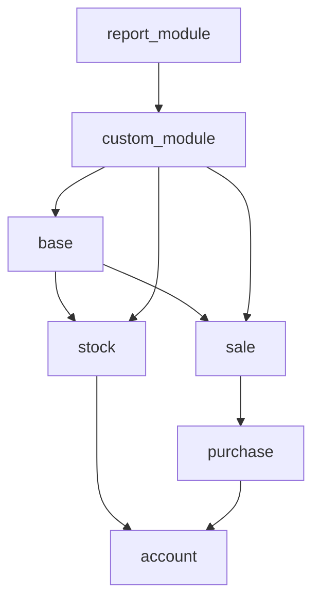
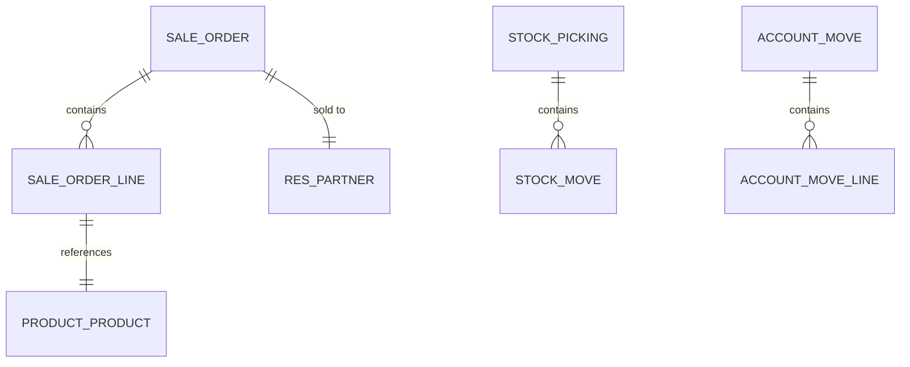

# Odoo Module Architecture Analysis

You are helping users understand the architecture of Odoo modules - how they're structured, how they relate to each other, and how data flows through them.

## Architecture Overview

### Standard Module Structure

```
module_name/
├── __init__.py              # Module initialization
├── __manifest__.py          # Module manifest (metadata)
├── models/
│   ├── __init__.py
│   ├── model_1.py           # Model definitions
│   └── model_2.py
├── views/
│   ├── model_views.xml      # View definitions
│   ├── menu.xml             # Menu items
│   └── actions.xml          # Window actions
├── controllers/
│   ├── __init__.py
│   └── main.py              # HTTP controllers
├── wizards/
│   ├── __init__.py
│   └── wizard_model.py      # Transient models
├── security/
│   ├── ir.model.access.csv  # Access control lists
│   └── record_rules.xml     # Record rules
├── data/
│   ├── data.xml             # Module data
│   └── demo.xml             # Demo data
├── i18n/
│   └── translations.pot     # Translation template
└── static/
    ├── src/
    │   ├── js/
    │   ├── xml/
    │   └── scss/
    └── lib/
```

## Analyzing a Module

### Step 1: Read the Manifest

```python
# __manifest__.py analysis
{
    'name': 'Module Name',
    'version': '17.0.1.0.0',
    'depends': ['base', 'sale'],  # Critical: dependencies
    'data': [
        'security/ir.model.access.csv',
        'views/views.xml',
    ],
    'assets': {},  # Web assets
    'application': True,  # Is this an app?
}
```

**Key Questions:**
- What does it depend on?
- What are its dependencies' dependencies?
- Is it an application or just an extra?

### Step 2: Analyze Models

```python
# For each model in models/__init__.py
class ModelName(models.Model):
    _name = 'module.model'
    _inherit = []           # What models does it extend?
    _inherits = {}          # What models does it delegate to?
    _description = ''       # Purpose

    # Field analysis
    name = fields.Char()    # What fields?
    partner_id = fields.Many2one('res.partner')  # Relations?
    line_ids = fields.One2many('model.line', 'parent_id')  # Children?

    # Methods
    def action_submit(self):  # What actions?
```

**Model Relationship Types:**

| Type | Field | Meaning |
|------|-------|---------|
| Many2one | `partner_id` | Many records point to one |
| One2many | `line_ids` | One record has many children |
| Many2many | `tag_ids` | Many records relate to many |
| Reference | `reference` | Dynamic reference to any model |

### Step 3: Map Inheritance Patterns

```python
# Pattern 1: Direct Extension
class SaleOrder(models.Model):
    _inherit = 'sale.order'  # Adds to sale.order

# Pattern 2: Abstract Mixin
class MailThread(models.AbstractModel):
    _name = 'mail.thread'  # Provides mail functionality

class MyModel(models.Model):
    _inherit = 'mail.thread'  # Gets mail features

# Pattern 3: Delegation
class ResPartner(models.Model):
    _inherits = {'res.partner': 'partner_id'}  # Links to res.partner
```

### Step 4: Analyze Dependencies

```
Dependency Chain Analysis:

module_a (depends on):
├── base (always)
├── sale
│   └── sale_management
│       └── sale_product_configurator
└── stock
    └── stock_account
        └── account
```

**To find dependencies:**
```bash
# Find all models and their _inherit
grep -r "_inherit" module/models/

# Find external_ids
grep -r "ref=" module/

# Build dependency tree
odoo-env python -c "
import ast
import os

def get_depends(manifest_path):
    import json
    with open(manifest_path) as f:
        content = f.read()
        # Parse manifest
        return json.loads(content).get('depends', [])
"
```

## Architecture Patterns

### Pattern 1: Extension Pattern

```python
# Extend existing model
class SaleOrderLine(models.Model):
    _inherit = 'sale.order.line'

    # Add new field
    custom_field = fields.Char(string='Custom Field')

    # Override existing method
    def write(self, vals):
        # Add custom logic before/after
        result = super().write(vals)
        # Custom post-processing
        return result
```

### Pattern 2: Abstract Model (Mixin)

```python
# Create reusable mixin
class CustomFieldsMixin(models.AbstractModel):
    _name = 'custom.fields.mixin'
    _description = 'Reusable custom fields'

    custom_name = fields.Char(string='Custom Name')
    custom_date = fields.Date(string='Custom Date')

# Use in multiple models
class ModelA(models.Model):
    _inherit = 'custom.fields.mixin'

class ModelB(models.Model):
    _inherit = 'custom.fields.mixin'
```

### Pattern 3: Delegation Inheritance

```python
# res.partner with custom fields
class ResPartnerExt(models.Model):
    _inherits = {'res.partner': 'partner_id'}
    _name = 'res.partner.ext'

    custom_field = fields.Char()
```

### Pattern 4: Composition Pattern

```python
# Child records owned by parent
class SaleOrder(models.Model):
    _name = 'sale.order'

    line_ids = fields.One2many(
        'sale.order.line',
        'order_id',  # inverse_name
        string='Order Lines'
    )

class SaleOrderLine(models.Model):
    _name = 'sale.order.line'

    order_id = fields.Many2one(
        'sale.order',
        string='Order',
        required=True,
        ondelete='cascade'  # Auto-delete lines when order deleted
    )
```

### Pattern 5: Service Layer Pattern

```python
# Business logic in separate service
class SaleOrderService:
    """Service for sale order operations"""

    def __init__(self, env):
        self.env = env

    def validate_order(self, order):
        """Validate order before confirmation"""
        if not order.line_ids:
            raise ValidationError("Order must have lines")
        return True

    def process_order(self, order_id):
        """Full order processing"""
        order = self.env['sale.order'].browse(order_id)
        self.validate_order(order)
        order.action_confirm()
        # ... more processing
```

## Data Flow Analysis

### Entry Points

```
HTTP Request → Controller → Service → Model → Database
                     ↓
              Return Response
```

### ORM Operations

```python
# Read flow
record = env['model'].browse(id)
# ORM → search count/read → SQL → Database → Results

# Write flow
record.write({'field': value})
# ORM → validate → constraint check → SQL UPDATE → Database
```

### Compute Flow

```python
# Computed field dependencies
@api.depends('line_ids.price_total')
def _compute_amount_total(self):
    for record in self:
        record.amount_total = sum(record.line_ids.mapped('price_total'))

# When line_ids changes → trigger _compute_amount_total
```

## Visualizing Architecture

### Module Relationship Diagram



### Model Relationships



## Key Files to Analyze

| File | What It Reveals |
|------|----------------|
| `__manifest__.py` | Dependencies, data files |
| `models/__init__.py` | All models in module |
| `models/*.py` | Model structure, fields, methods |
| `views/*.xml` | UI structure, view inheritance |
| `security/*.csv` | Access rights |
| `controllers/*.py` | External API entry points |

## Architecture Checklist

When analyzing a module, verify:

- [ ] **Single Responsibility**: Does the module have one clear purpose?
- [ ] **Dependency Direction**: Do dependencies flow correctly (core → specialized)?
- [ ] **No Circular Dependencies**: Can you identify circular imports?
- [ ] **Proper Inheritance**: Is inheritance used correctly?
- [ ] **Access Control**: Are ACLs and record rules properly defined?
- [ ] **Data Isolation**: Can module data be cleanly uninstalled?
- [ ] **Performance**: Are there N+1 query risks?

## Summary Output Format

```
## Module Architecture Summary: {module_name}

### Purpose
{brief description}

### Dependencies
- Direct: {list}
- Inherited: {list}

### Models
- {model_name}: {purpose}
- ...

### Key Relationships
{diagram or description}

### Data Flow
{entry points → processing → storage}

### External Integrations
{APIs, webhooks, external services}

### Security Considerations
{access control, data isolation}

### Potential Issues
{identified problems or risks}
```
