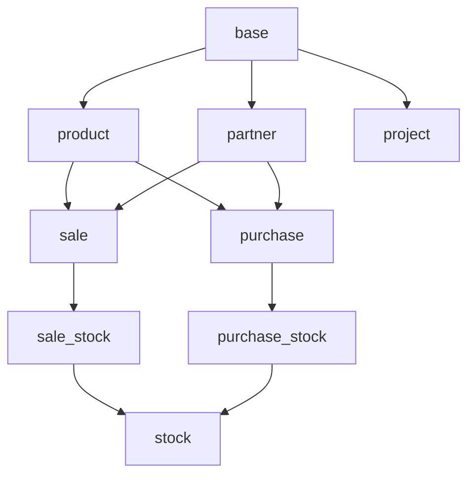

# Odoo Cross-Module Analysis Skill

## Overview

Skill ini membantu menganalisis bagaimana modul-modul Odoo saling terhubung dan berinteraksi. Dalam ekosistem Odoo, modul jarang berdiri sendiri - mereka membentuk jaringan kompleks dari dependencies, shared models, dan integration points. Memahami hubungan ini esensial untuk:

- Debugging issues yang melintasi modul
- Migration yang aman antar versi
- Pengembangan fitur baru yang tidak merusak modul lain
- Performance optimization
- Security analysis

## Prerequisites

Sebelum menggunakan skill ini, pastikan Anda memiliki:
- Akses ke source code Odoo (CE atau EE)
- Pemahaman dasar tentang Odoo module structure
- Familiar dengan Python dan Odoo ORM
- Knowledgable tentang Odoo manifest (__manifest__.py / __openerp__.py)

## Step 1: Identify Module Dependencies

### Memahami Module Dependency

Module dependencies di Odoo didefinisikan dalam `__manifest__.py` (Odoo 10+) atau `__openerp__.py` (Odoo 9 dan sebelumnya). Dependencies menentukan:
- Modul mana yang harus ter-install sebelum modul ini
- Model apa yang akan digunakan/extends
- Resource apa yang akan di-inherit

### Cara Membaca Dependencies

Buka file `__manifest__.py` dan cari key `'depends'`:

```python
{
    'name': 'Sales',
    'version': '19.0.1.0.0',
    'category': 'Sales',
    'summary': 'Sales Management',
    'depends': [
        'base',
        'product',
        'partner',
        'sale_management',
        'account',
    ],
    'data': [
        'security/sales_security.xml',
        'views/sale_order_views.xml',
        'views/sale_order_line_views.xml',
    ],
}
```

### Kategori Dependencies

#### 1. Required Dependencies
Modul yang HARUS ter-install agar modul ini bisa di-install. Jika salah satu missing, Odoo akan menolak installasi.

```python
# Contoh: sale_stock membutuhkan sale dan stock
'depends': ['sale', 'stock'],
```

#### 2. Optional Dependencies
Modul yang增强功能 tetapi tidak wajib.Biasanya ditambahkan untuk integrasi.

```python
# Contoh: product_email_template hanya butuh base
# Tetapi menambahkan fitur jika website ter-install
'depends': ['base'],
```

#### 3. Soft Dependencies
Dependencies yang ditambahkan untuk kompatibilitas atau feature enhancement tanpa hard requirement.

### Tool untuk Menganalisis Dependencies

Gunakan Grep untuk mencari dependencies di seluruh project:

```bash
# Cari semua dependencies di project
grep -r "'depends'" --include="__manifest__.py" /path/to/addons/

# Cari dependencies spesifik
grep -r "'depends':" -A 10 --include="__manifest__.py" /path/to/addons/sale/
```

### Membangun Dependency Tree

Untuk memahami full dependency chain, gunakan approach ini:

1. **Identifikasi direct dependencies** - dari manifest
2. **Rekursif** - cari dependencies dari setiap dependency
3. **Cek circular dependencies** - yang bisa menyebabkan issues

```python
# Contoh dependency tree untuk sale_stock
sale_stock
├── sale
│   ├── base
│   ├── product
│   ├── partner
│   └── sale_management
└── stock
    ├── base
    ├── product
    └── stock_account (optional)
```

### Tool OTomatIS untuk Dependency Analysis

Gunakan script Python untuk membangun dependency graph:

```python
import os
import json
from collections import defaultdict

def get_all_dependencies(addons_path):
    """Build complete dependency tree"""
    dependencies = defaultdict(set)

    for root, dirs, files in os.walk(addons_path):
        if '__manifest__.py' in files:
            manifest_path = os.path.join(root, '__manifest__.py')
            # Read and parse manifest
            # Add to dependencies dict

    return dependencies

def build_tree(module_name, all_deps, visited=None):
    """Build dependency tree for a module"""
    if visited is None:
        visited = set()

    if module_name in visited:
        return {}

    visited.add(module_name)
    tree = {module_name: {}}

    for dep in all_deps.get(module_name, []):
        tree[module_name][dep] = build_tree(dep, all_deps, visited.copy())

    return tree
```

## Step 2: Analyze Shared Models

### Konsep Shared Models

Shared models adalah model yang digunakan atau di-extend oleh multiple modules. Ini adalah integration point utama dalam Odoo. Contoh:

- `res.partner` - digunakan oleh base, sale, purchase, account, dll
- `res.users` - digunakan oleh base, hr, project, dll
- `account.move` - digunakan oleh account, sale, purchase, stock, dll

### Cara Mengidentifikasi Shared Models

#### 1. Cari model definition

```bash
# Cari semua yang mendefinisikan sale.order
grep -r "class sale.order" --include="*.py" /path/to/addons/

# Cari yang meng-inherit sale.order
grep -r "_name = 'sale.order'" --include="*.py" /path/to/addons/
```

#### 2. Analyze model inheritance

```python
# Single inheritance
class SaleOrder(models.Model):
    _name = 'sale.order'
    _inherit = ['mail.thread', 'mail.activity.mixin']

# Extension inheritance
class SaleOrderExtension(models.Model):
    _name = 'sale.order.extension'  # Different name
    _inherit = 'sale.order'  # Inherits all fields/methods
```

#### 3. Check untuk shared fields

```python
# Di sale module
class SaleOrder(models.Model):
    _name = 'sale.order'

    partner_id = fields.Many2one('res.partner', string='Customer')

# Di account module - menambahkan field ke sale.order
class AccountMove(models.Model):
    _inherit = 'sale.order'

    invoice_count = fields.Integer(...)
```

### Tipe Shared Models

#### A. Core Models (base)
Model fundamental yang hampir semua modul gunakan:
- `res.partner` - Customer, Vendor, Contact
- `res.users` - User management
- `res.company` - Multi-company
- `res.currency` - Currency management
- `res.lang` - Language
- `res.country` / `res.country.state` - Location

#### B. Business Models
Model yang di-share di domain bisnis:
- `account.move` - Accounting entries
- `stock.picking` - Stock operations
- `project.project` - Project management
- `project.task` - Task management
- `hr.employee` - Employee data

#### C. Technical Models
Model untuk teknis:
- `ir.model` - Model metadata
- `ir.ui.menu` - Menu items
- `ir.actions.act_window` - Window actions
- `ir.attachment` - Attachments

### Analisis Pola Penggunaan

#### Pattern 1: Extension via _inherit

```python
# base/models/res_partner.py
class ResPartner(models.Model):
    _name = 'res.partner'
    _inherit = ['res.partner', 'mail.thread', 'mail.activity.mixin']

    name = fields.Char(required=True)
    email = fields.Char()
    phone = fields.Char()

# sale/models/partner.py
class ResPartner(models.Model):
    _inherit = 'res.partner'

    sale_order_count = fields.Integer(
        string='Sale Order Count',
        compute='_compute_sale_order_count',
    )

    def _compute_sale_order_count(self):
        # Compute logic
        pass

# purchase/models/partner.py
class ResPartner(models.Model):
    _inherit = 'res.partner'

    purchase_order_count = fields.Integer(...)
```

#### Pattern 2: Related Fields

```python
# sale/models/sale_order.py
class SaleOrder(models.Model):
    _name = 'sale.order'

    partner_id = fields.Many2one('res.partner', required=True)
    partner_invoice_id = fields.Many2one('res.partner')
    partner_shipping_id = fields.Many2one('res.partner')

# Dari perspektif res.partner - akses order
class ResPartner(models.Model):
    _inherit = 'res.partner'

    sale_order_ids = fields.One2many('sale.order', 'partner_id')
```

#### Pattern 3: Delegation

```python
# Menggunakan delegation untuk split model
class SaleOrderLine(models.Model):
    _name = 'sale.order.line'
    _inherits = {'product.product': 'product_id'}

    # Ini membuat sale.order.line memiliki semua fields dari product.product
    product_id = fields.Many2one('product.product', required=True)
```

### Tools untuk Analisis Shared Models

```bash
# Cari semua yang extends res.partner
grep -r "_inherit = 'res.partner'" --include="*.py" /path/to/addons/

# Cari semua Many2one ke res.partner
grep -r "Many2one.*res.partner" --include="*.py" /path/to/addons/

# Cari semua One2many dari res.partner
grep -r "One2many.*res.partner" --include="*.py" /path/to/addons/
```

## Step 3: Trace Cross-Module References

### Jenis Cross-References

#### 1. Field References (Many2one, One2many, Many2many)

**Many2one** - Reference ke model lain:
```python
class SaleOrder(models.Model):
    _name = 'sale.order'

    # Reference ke partner (base)
    partner_id = fields.Many2one('res.partner', string='Customer')

    # Reference ke product (product)
    order_line = fields.One2many('sale.order.line', 'order_id')

    # Reference ke account.move
    invoice_ids = fields.Many2many('account.move')
```

**One2many** - Reverse dari Many2one:
```python
class ResPartner(models.Model):
    _inherit = 'res.partner'

    sale_order_ids = fields.One2many('sale.order', 'partner_id')
```

**Many2many** - Many to many relationship:
```python
class SaleOrder(models.Model):
    _name = 'sale.order'

    # Many2many ke tag
    tag_ids = fields.Many2many('sale.order.tag')
```

#### 2. Method Calls Across Modules

```python
# Di sale_order.py
def action_confirm(self):
    # Memanggil method dari stock module
    self.env['stock.picking'].create({
        'partner_id': self.partner_id.id,
        'picking_type_id': self.env.ref('stock.picking_type_out').id,
    })
    # Memanggil method dari account module
    self.action_invoice_create()
```

#### 3. XML External IDs (xmlid)

External IDs digunakan untuk mereferensikan records antar modul:

```python
# Reference ke xmlid
self.env.ref('sale.order_form_view')

# Di XML
<field name="partner_id" ref="base.partner_demo"/>

# Dengan kompilasi domain
<field name="warehouse_id"
       domain="[('company_id', '=', current_company_id)]"/>
```

#### 4. Computed Fields dengan Related Models

```python
class SaleOrderLine(models.Model):
    _name = 'sale.order.line'

    # Computed field yang mengambil dari product.product
    product_category_id = fields.Many2one(
        'product.category',
        related='product_id.categ_id',
        store=True,
    )
```

### Teknik Tracing References

#### A. Menggunakan Grep untuk Cari References

```bash
# Cari semua yang mereferensikan sale.order
grep -r "sale.order" --include="*.py" /path/to/addons/

# Cari field definition
grep -r "fields.Many2one.*'sale.order'" --include="*.py" /path/to/addons/

# Cari method calls
grep -r "sale_order\." --include="*.py" /path/to/addons/
```

#### B. Gunakan Odoo Shell untuk Tracing

```python
# Di Odoo shell
# Cari semua field yang mereferensikan sale.order
fields = env['ir.model.fields'].search([
    ('relation', '=', 'sale.order')
])
for f in fields:
    print(f.model_id.name, f.name)

# Cari semua model yang inherits sale.order
models = env['ir.model'].search([
    ('inherited_model_ids.name', '=', 'sale.order')
])
```

#### C. Analisis XML Views

```python
# Cari semua view yang memodifikasi sale.order
views = env['ir.ui.view'].search([
    ('model', '=', 'sale.order')
])

# Cari inheritances
inheritances = env['ir.ui.view'].search([
    ('inherit_id.model', '=', 'sale.order')
])
```

### Cross-Reference Patterns

#### Pattern 1: Service Layer

```python
# sale/models/sale_order.py
class SaleOrder(models.Model):
    _name = 'sale.order'

    def _create_invoices(self, grouped=False, final=False):
        # Panggil account module service
        return self.env['account.move'].sudo().create_invoices(self, grouped, final)
```

#### Pattern 2: Callback / Hook

```python
# base module mendefinisikan hook
class ResPartner(models.Model):
    _name = 'res.partner'

    def _commercial_sync(self):
        """Hook untuk sync commercial data"""
        self.ensure_one()
        # Default implementation
        pass

# sale module overrides hook
class ResPartner(models.Model):
    _inherit = 'res.partner'

    def _commercial_sync(self):
        super()._commercial_sync()
        # Custom sale logic
        self._update_sale_order_count()
```

#### Pattern 3: Event / Notification

```python
# Menggunakan Odoo bus atau messaging
# sale module
def action_confirm(self):
    res = super().action_confirm()

    # Notify stock module
    self.env['bus.bus']._sendmany([
        (channel, 'stock.picking', {
            'operation': 'create',
            'order_id': self.id,
        })
        for channel in self.env['stock.picking']._bus_channel()
    ])

    return res
```

## Step 4: Identify Hook Points

### Jenis Hook Points di Odoo

#### 1. Extension Methods (super() calls)

Poin paling umum untuk extend functionality:

```python
# Di base module
class BaseModel(models.Model):
    _name = 'base.model'

    def some_method(self, arg1, arg2):
        """Base implementation"""
        # Do something
        return result

# Di module extension
class ExtendedModel(models.Model):
    _name = 'extended.model'
    _inherit = 'base.model'

    def some_method(self, arg1, arg2):
        """Override dengan super()"""
        # Panggil parent implementation
        result = super().some_method(arg1, arg2)
        # Add custom logic
        return result
```

#### 2. _hook Methods

Method yang sengaja dibuat untuk di-override:

```python
class SaleOrder(models.Model):
    _name = 'sale.order'

    def _prepare_invoice(self):
        """Hook untuk prepare invoice values"""
        self.ensure_one()
        values = {
            'partner_id': self.partner_id.id,
            'move_type': 'out_invoice',
        }
        return self._hook_invoice_values(values)

    def _hook_invoice_values(self, values):
        """Hook - override ini untuk customize values"""
        return values
```

#### 3. Abstract Models sebagai Hook

```python
# sale/models/sale_order.py
class SaleOrder(models.AbstractModel):
    _name = 'sale.order'
    _description = 'Sales Order'

    # Abstract model untuk di-inherit

class SaleOrderLine(models.Model):
    _name = 'sale.order.line'
    _inherits = {'product.product': 'product_id'}
```

#### 4. Inheritance via _inherits

```python
# product.product di-inherit oleh sale.order.line
class SaleOrderLine(models.Model):
    _name = 'sale.order.line'
    _inherits = {
        'product.product': 'product_id',
    }
```

#### 5. Mixins

```python
# mail.thread adalah mixin yang banyak digunakan
class SaleOrder(models.Model):
    _name = 'sale.order'
    _inherit = ['mail.thread', 'mail.activity.mixin']

    # Automatically mendapatkan:
    # - message_ids
    # - message_follower_ids
    # - message_partner_ids
    # - activity_ids
```

#### 6. Website Context Hooks

```python
# Dengan website_sale
class SaleOrder(models.Model):
    _name = 'sale.order'

    def _cart_update(self, product_id=None, line_id=None, add_qty=0, set_qty=0, **kwargs):
        # Hook yang dipanggil saat cart di-update
        values = self._cart_update_values(product_id, add_qty, set_qty, **kwargs)
        return values
```

#### 7. Model Constraints Hook

```python
class SaleOrder(models.Model):
    _name = 'sale.order'

    @api.constrains('state', 'order_line')
    def _check_order_has_lines(self):
        """Constrains yang bisa di-extend"""
        for order in self:
            if not order.order_line and order.state in ('sale', 'done'):
                raise ValidationError(_('Order must have at least one line'))
```

### Cara Menemukan Hook Points

```bash
# Cari semua super() calls
grep -r "super()" --include="*.py" /path/to/addons/sale/

# Cari semua _hook methods
grep -r "def _hook" --include="*.py" /path/to/addons/

# Cari semua mixin usage
grep -r "_inherit.*mail.thread" --include="*.py" /path/to/addons/
```

### Best Practices Hooking

1. **Selalu call super()** - kecuali jika sengaja replace
2. **Gunakan @api.returns** - untuk return type consistency
3. **Gunakan ensure_one()** - untuk recordset operations
4. **Check access rights** - dengan sudo() jika perlu
5. **Use hooks yang sudah ada** - daripada memodifikasi core

## Step 5: Document Relationships

### Membuat Dependency Diagram

#### Manual Diagram (Mermaid)



#### Automatis dengan Script

```python
import json

def generate_dependency_graph(addons_path):
    """Generate JSON dependency graph"""
    graph = {
        'nodes': [],
        'edges': []
    }

    # Parse semua manifest
    # Build nodes dan edges

    return graph
```

### Template Documentation

## Cross-Module Analysis Report

### Module Under Analysis
- **Name**: [Module Name]
- **Version**: [Version]
- **Category**: [Category]

### Dependencies

#### Direct Dependencies
| Module | Type | Purpose |
|--------|------|---------|
| base | Required | Core functionality |
| product | Required | Product management |
| sale_management | Required | Sales features |

#### Dependency Tree
```
module_name
├── base
├── product
│   └── product_margin
└── sale_management
```

### Shared Models

#### Models Extended
| Model | Extension Type | Fields Added |
|-------|---------------|--------------|
| res.partner | Extension | sale_order_count |
| sale.order | Extension | x_custom_field |

#### External References
| Model | Field | Type |
|-------|-------|------|
| res.partner | partner_id | Many2one |
| product.product | product_id | Many2one |

### Integration Points

#### Method Calls
| Method | Called Module | Purpose |
|--------|---------------|---------|
| _create_invoice | account | Create invoice |
| _update_stock | stock | Update quantities |

#### XML References
| XML ID | Type | Purpose |
|--------|------|---------|
| sale.order_form | View | Form view |
| sale.order_tree | View | List view |

### Extension Patterns

#### Hook Points Identified
1. _hook_invoice_values - Custom invoice preparation
2. _compute_amount - Custom total computation
3. action_confirm - Custom confirmation logic

#### Mixins Used
- mail.thread - Messaging
- mail.activity.mixin - Activities

## Common Cross-Module Patterns

### Sales + Account Integration

| Aspect | Sale Module | Account Module |
|--------|-------------|-----------------|
| Order | sale.order | - |
| Invoice | account.move | Created from sale |
| Payment | account.payment | Linked to invoice |

```python
# sale -> account flow
class SaleOrder(models.Model):
    def action_invoice_create(self):
        # Create account.move
        invoice = self.env['account.move'].create(values)
        return invoice.id
```

### Sales + Stock Integration

| Aspect | Sale Module | Stock Module |
|--------|-------------|--------------|
| Delivery | stock.picking | Created from sale |
| Reservation | stock.quant | Reserve products |

```python
# sale -> stock flow
class SaleOrder(models.Model):
    def _action_launch_stock_rule(self):
        # Launch procurement
        self.env['stock.rule']._run_pull()
```

### Purchase + Account Integration

| Aspect | Purchase | Account |
|--------|----------|---------|
| Order | purchase.order | - |
| Vendor Bill | account.move | Created from PO |
| Payment | account.payment | Linked to bill |

### Project + Task + Timesheet Integration

```python
# project + hr_timesheet
class ProjectProject(models.Model):
    _inherit = 'project.project'

    timesheet_ids = fields.One2many(
        'account.analytic.line',
        'task_id',
        timesheet related fields
    )
```

### Common Issues dan Solutions

#### Issue 1: Circular Dependencies
```
Module A depends on B
Module B depends on A
```
**Solution**: Refactor ke shared module C

#### Issue 2: Method Override Conflict
```
Module A overrides method X
Module B overrides method X
```
**Solution**: Gunakan Hook pattern atau split functionality

#### Issue 3: Field Conflict
```
Module A adds field 'name' to Model X
Module B adds field 'name' to Model X
```
**Solution**: Gunakan unique field names atau inherit berbeda

#### Issue 4: XML ID Conflicts
```
Module A defines xmlid 'sale.order_view_form'
Module B defines same xmlid
```
**Solution**: Use unique prefix (module-specific)

## Practical Examples

### Example 1: Analyzing sale_stock Module

```python
# Dari __manifest__.py
{
    'name': 'Sales Stock',
    'depends': ['sale', 'stock'],
    ...
}

# Dependencies:
# sale -> base, product, partner, sale_management, account
# stock -> base, product, stock_account, mail

# Shared models:
# - stock.picking (extended by sale_stock)
# - sale.order (adds picking_ids)
```

### Example 2: Analyzing account_analytic_default

```python
# Depends: base, account
# Inherits: product.product, sale.order.line, purchase.order.line

# Shared fields:
# - analytic_default_id (Many2one)
# - Analytic hooks di berbagai model
```

### Example 3: Custom Module Integration

```python
# custom_sale_extension/__manifest__.py
{
    'name': 'Custom Sale Extension',
    'depends': ['sale', 'product'],
    ...
}

# Models:
# - sale.order (extends)
# - sale.order.line (extends)
# - custom.model (new)
```

## Output Format

## Cross-Module Analysis

### Module: [Module Name]

#### Dependencies
```
[Dependency tree atau list]

Required:
- base
- product
- sale_management

Optional:
- website_sale
```

#### Shared Models
| Model | Type | Fields Added |
|-------|------|--------------|
| sale.order | Extended | 3 |
| res.partner | Extended | 2 |
| product.product | Extended | 1 |

#### Integration Points

**Incoming References** (Other modules calling this):
- stock.picking: _create_delivery()
- account.move: _invoice_create()

**Outgoing References** (This module calling others):
- account.move: create()
- stock.picking: create()

#### Extension Patterns

**Hooks Identified**:
1. _hook_custom_invoice
2. _compute_custom_total

**Mixins Used**:
- mail.thread
- mail.activity.mixin

### Recommendations

1. **Breaking Changes Risk**: [Low/Medium/High]
2. **Migration Considerations**: [List]
3. **Test Coverage Needed**: [List]

## Checklist

- [ ] Identifikasi semua dependencies dari manifest
- [ ] Build complete dependency tree
- [ ] Identifikasi shared models
- [ ] Trace semua cross-references
- [ ] Dokumentasikan hook points
- [ ] Check untuk potential conflicts
- [ ] Generate diagram jika diperlukan
- [ ] Review untuk security implications
- [ ] Test pada clean install
- [ ] Document findings

## Tips dan Tricks

1. **Gunakan grep efficiently**: `grep -r "pattern" --include="*.py" folder/`
2. **Manfaatkan Odoo shell**: Testing references interaktif
3. **Check __init__.py**: часто module imports di sini
4. **Review security XML**: ACLs juga bagian dari dependencies
5. **Use IDE navigation**: Go to definition untuk trace references
6. **Check tests**: Test files sering menunjukkan bagaimana modules berinteraksi
7. **Document as you go**: Setiap analysis harus didokumentasikan

## Troubleshooting

### Circular Dependency Detection
```python
# Di Odoo shell
import itertools

def detect_cycles(dependencies):
    # Graph cycle detection
    for cycle in itertools.cycle_detection(dependencies):
        print(f"Circular dependency: {' -> '.join(cycle)}")
```

### Missing Dependencies
```python
# Check what's missing
def check_dependencies(module_name):
    manifest = load_manifest(module_name)
    for dep in manifest.get('depends', []):
        if not module_exists(dep):
            print(f"Missing: {dep}")
```

### Version Compatibility
```python
# Check module version compatibility
def check_version_compatibility(module_name, target_version):
    manifest = load_manifest(module_name)
    module_version = manifest.get('version', '')
    # Compare dengan target
```

## References

- Odoo Official Documentation: Module Dependencies
- Odoo Developer Documentation: Inheritance
- Odoo ORM Documentation: Models and Fields

## See Also

- odoo-data-model-analysis - Untuk analisis struktur data
- odoo-migration-checklist - Untuk migration analysis
- odoo-debug-tdd - Untuk debugging inter-module issues
