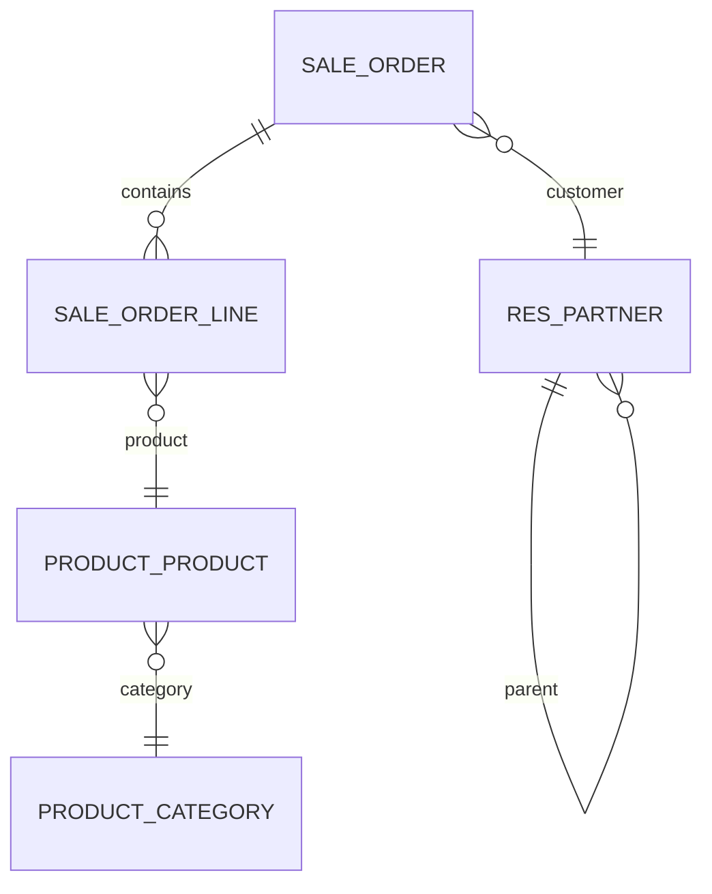

# Odoo Data Model Analysis Skill

## Overview

Skill ini membantu menganalisis struktur data dan model dalam Odoo. Pemahaman mendalam tentang data model esensial untuk:
- Designing integrations yang efisien
- Debugging data-related issues
- Optimizing performance
- Migration antar versi
- Security analysis
- Database design decisions

## Prerequisites

Sebelum menggunakan skill ini, pastikan Anda memahami:
- Odoo ORM dan Model inheritance
- Python programming
- SQL basics dan PostgreSQL
- Odoo field types dan attributes
- Constraint concepts

## Step 1: Identify Model Relationships

### Jenis Relasi dalam Odoo

Odoo menyediakan beberapa jenis relasi antar model:

#### 1. Many2one (Foreign Key)

Many2one adalah relasi paling umum - many records bisa point ke satu record.

```python
class SaleOrder(models.Model):
    _name = 'sale.order'

    # Satu customer per order
    partner_id = fields.Many2one(
        'res.partner',           # Target model
        string='Customer',       # Label
        required=True,            # Mandatory field
        ondelete='restrict',     # DB behavior: restrict/cascade/set null
        index=True,               # Create database index
    )
```

**Database Representation**:
```sql
-- sales_order table
CREATE TABLE sale_order (
    id SERIAL PRIMARY KEY,
    partner_id INTEGER REFERENCES res_partner(id) ON DELETE RESTRICT,
    ...
);
```

**Attributes yang tersedia**:
| Attribute | Description | Values |
|----------|-------------|--------|
| comodel | Target model name | String |
| string | Field label | String |
| required | Mandatory field | Boolean |
| ondelete | DB cascade behavior | 'restrict', 'cascade', 'set null' |
| index | Create DB index | Boolean |
| domain | Filter records | List of tuples |
| context | Context for onchange | Dict |
| readonly | Cannot edit | Boolean |

**Common Patterns**:

```python
# Dengan domain filtering
warehouse_id = fields.Many2one(
    'stock.warehouse',
    string='Warehouse',
    domain="[('company_id', '=', company_id)]",
    default=lambda self: self.env.company.warehouse_id,
)

# Dengan context
categ_id = fields.Many2one(
    'product.category',
    string='Product Category',
    context={'tree_view_ref': 'product.product_category_view_tree'},
)

# Dengan ondelete cascade
parent_id = fields.Many2one(
    'product.category',
    string='Parent Category',
    ondelete='cascade',
    index=True,
)
```

#### 2. One2many (Reverse Many2one)

One2many adalah kebalikan dari Many2one - satu record punya banyak record terkait.

```python
class ResPartner(models.Model):
    _name = 'res.partner'

    # Satu partner bisa punya banyak sales orders
    sale_order_ids = fields.One2many(
        'sale.order',             # Target model
        'partner_id',             # Foreign key field di target
        string='Sales Orders',
    )
```

**Database Representation**:
```sql
-- Tidak ada kolom khusus di res_partner
-- Query ke sale_order WHERE partner_id = self.id
```

**Important Notes**:
- One2many adalah virtual - tidak disimpan di database
- Selalu punya inverse Many2one di model target
- Tidak bisa di-search langsung (harus use related Many2one)

**Complex Example**:

```python
class SaleOrder(models.Model):
    _name = 'sale.order'

    order_line = fields.One2many(
        'sale.order.line',
        'order_id',
        string='Order Lines',
        copy=True,                 # Copy lines saat order di-duplicate
        auto_join=True,            # JOIN otomatis untuk performance
    )

class SaleOrderLine(models.Model):
    _name = 'sale.order.line'

    order_id = fields.Many2one(
        'sale.order',
        string='Order Reference',
        required=True,
        ondelete='cascade',
        index=True,
    )
```

#### 3. Many2many (M2M Table)

Many2many membuat relasi many-to-many menggunakan relation table.

```python
class SaleOrder(models.Model):
    _name = 'sale.order'

    # Order bisa punya banyak tags
    tag_ids = fields.Many2many(
        'sale.order.tag',         # Target model
        'sale_order_tag_rel',     # Relation table name (optional)
        'order_id',               # Column 1 di relation table
        'tag_id',                 # Column 2 di relation table
        string='Tags',
    )
```

**Database Representation**:
```sql
-- Relation table
CREATE TABLE sale_order_tag_rel (
    order_id INTEGER REFERENCES sale_order(id) ON DELETE CASCADE,
    tag_id INTEGER REFERENCES sale_order_tag(id) ON DELETE CASCADE,
    PRIMARY KEY (order_id, tag_id)
);
```

**Attributes**:

| Attribute | Description |
|-----------|-------------|
| comodel | Target model |
| relation | Table name (optional, auto-generated) |
| column1 | FK to model |
| column2 | FK to comodel |
| ondelete | Cascade behavior |

**Example dengan custom relation**:

```python
class ProjectProject(models.Model):
    _name = 'project.project'

    tag_ids = fields.Many2many(
        'project.tags',
        'project_tag_rel',
        'project_id',
        'tag_id',
        string='Tags',
        ondelete='cascade',
    )
```

#### 4. Delegation Inheritance (_inherits)

Delegation memungkinkan model untuk "mewarisi" fields dari model lain.

```python
class SaleOrderLine(models.Model):
    _name = 'sale.order.line'
    _inherits = {
        'product.product': 'product_id',  # Delegation ke product
    }

    product_id = fields.Many2one(
        'product.product',
        string='Product',
        required=True,
        ondelete='cascade',
    )
```

**Database Representation**:
```sql
-- sale_order_line table
CREATE TABLE sale_order_line (
    id SERIAL PRIMARY KEY,
    product_id INTEGER REFERENCES product_product(id) ON DELETE CASCADE,
    -- Semua fields dari product.product juga ada di sini
    name TEXT,  -- Dari product
    list_price NUMERIC,  -- Dari product
    ...
);
```

**Karakteristik**:
- Child record otomatis punya akses ke parent fields
- Tidak ada separate record di parent table
- delete cascade ke parent

### Relationship Best Practices

```python
# GOOD: Explicit ondelete dan index
partner_id = fields.Many2one(
    'res.partner',
    required=True,
    ondelete='restrict',  # prevent deletion of partner with orders
    index=True,
)

# GOOD: Auto_join untuk One2many performance
order_line = fields.One2many(
    'sale.order.line',
    'order_id',
    auto_join=True,
)

# GOOD: Cascade deletion untuk dependent records
move_line_ids = fields.One2many(
    'account.move.line',
    'move_id',
    ondelete='cascade',  # Delete lines when move deleted
)
```

## Step 2: Analyze Field Types

### Primitive Types

#### Char
```python
name = fields.Char(
    string='Name',
    size=128,  # Max length (deprecated, use index=False for long text)
    required=True,
    index=True,
)
```
- Stored as VARCHAR
- Searchable
- Supports translation (translate=True)

#### Text
```python
description = fields.Text(
    string='Description',
    translate=True,  # Enable translation
)
```
- Stored as TEXT
- NOT searchable directly
- Unlimited length

#### Integer
```python
sequence = fields.Integer(
    string='Sequence',
    default=10,
    group_operator='sum',  # For grouping in tree views
)
```
- Stored as INTEGER
- Searchable
- Supports grouping

#### Float
```python
amount = fields.Float(
    string='Amount',
    digits=(16, 2),  # (total digits, decimal places)
    default=0.0,
)
```
- Stored as NUMERIC/DOUBLE
- Searchable
- Supports currency rounding

#### Boolean
```python
active = fields.Boolean(
    string='Active',
    default=True,
)
```
- Stored as BOOLEAN
- Searchable

#### Date dan Datetime
```python
date = fields.Date(
    string='Date',
    default=fields.Date.today,
)

datetime = fields.Datetime(
    string='Date Time',
    default=fields.Datetime.now,
)
```
- Date stored as DATE
- Datetime stored as TIMESTAMP
- Searchable
- Supports calendar widget

#### Selection
```python
state = fields.Selection([
    ('draft', 'Draft'),
    ('confirm', 'Confirmed'),
    ('done', 'Done'),
], string='State', default='draft')
```
- Stored as VARCHAR
- Searchable
- Supports translations

### Relational Types

#### Many2one
```python
partner_id = fields.Many2one('res.partner', string='Partner')
```
- Stored as INTEGER (FK)
- Searchable
- Supports display_name

#### One2many
```python
line_ids = fields.One2many('model.line', 'parent_id')
```
- Virtual field
- Not stored
- Not searchable

#### Many2many
```python
tag_ids = fields.Many2many('model.tag')
```
- Stored in relation table
- Not directly searchable (use search on related)

#### Reference
```python
reference = fields.Reference(
    [('sale.order', 'Sale Order'), ('account.move', 'Invoice')],
    string='Reference',
)
```
- Stores model name + record ID
- Flexible but slower than Many2one

### Special Types

#### Binary
```python
data = fields.Binary(
    string='File',
    attachment=True,  # Store in filestore
)
```
- Can store as base64 in DB
- Or as file in filestore (attachment=True)

#### HTML
```python
description = fields.Html(
    string='Description',
    sanitize=True,  # Strip dangerous HTML
    sanitize_tags=False,
    sanitize_attributes=False,
)
```
- Stored as TEXT
- Supports HTML sanitization

#### Monetary
```python
amount = fields.Monetary(
    string='Amount',
    currency_field='currency_id',
)
```
- Like Float but currency-aware
- Automatically uses company currency

#### Many2one Reference
```python
res_id = fields.Many2oneReference(
    string='Resource ID',
    model_field='res_model',
)
```
- Dynamic Many2one based on model_field

### Computed Fields

```python
amount_total = fields.Float(
    string='Total',
    compute='_compute_amount_total',
    store=True,  # Store in DB
    compute_sudo=True,  # Compute with elevated privileges
)

@api.depends('price_unit', 'product_uom_qty')
def _compute_amount_total(self):
    for record in self:
        record.amount_total = record.price_unit * record.product_uom_qty
```

**Compute Options**:
| Option | Description |
|--------|-------------|
| compute | Method name untuk calculate |
| store | Save to DB (True) or calculate on-fly (False) |
| compute_sudo | Run dengan sudo (for access rights) |
| recursive | Recompute on dependent changes |
| depends_context | Context untuk compute (e.g., company) |

**Store vs Non-Store**:
- `store=False` (default): Dihitung saat diakses
- `store=True`: Dihitung saat dependency berubah, disimpan di DB
- `store=True` + `index=True`: Can be searched efficiently

### Related Fields

```python
partner_name = fields.Char(
    string='Partner Name',
    related='partner_id.name',
    store=True,  # Can store for faster access
    readonly=True,
)
```

### Field Attributes Reference

| Attribute | Type | Description |
|-----------|------|-------------|
| string | str | Field label |
| help | str | Hover help text |
| readonly | bool | Editable? |
| required | bool | Mandatory? |
| index | bool | Create DB index |
| store | bool | Store in DB (for computed) |
| copy | bool | Copy in duplicate |
| default | value/lambda | Default value |
| groups | str | Visibility by group |
| states | dict | State-based attributes (deprecated) |
| attrs | dict | Dynamic attributes (deprecated) |
| invisible | bool | Hide in view |

## Step 3: Analyze Constraints

### API Constraints (@api.constrains)

```python
from odoo.exceptions import ValidationError

class SaleOrder(models.Model):
    _name = 'sale.order'

    @api.constrains('date_order', 'validity_date')
    def _check_date(self):
        for order in self:
            if order.validity_date and order.date_order:
                if order.validity_date < order.date_order:
                    raise ValidationError(
                        _('Validity date must be greater than order date')
                    )
```

**Characteristics**:
- Dipanggil saat record di-create atau di-update
- Valid untuk semua field yang di-track
- Transaction akan di-rollback jika constraint violation
- Use untuk business rules

**Best Practices**:
```python
# GOOD: Clear error message
@api.constrains('field1', 'field2')
def _check_condition(self):
    for record in self:
        if record.field1 > record.field2:
            raise ValidationError(
                _('Field1 must be less than or equal to Field2')
            )

# GOOD: Multiple checks dengan jelas
@api.constrains('state', 'order_line')
def _check_lines_exist(self):
    for order in self:
        if order.state in ('sale', 'done') and not order.order_line:
            raise ValidationError(_('Order must have lines'))
```

### SQL Constraints (sql_constraints)

```python
class ProductProduct(models.Model):
    _name = 'product.product'

    _sql_constraints = [
        ('default_code_unique', 'UNIQUE(default_code)',
         'Product reference must be unique!'),
        (
            'name_check',
            'CHECK(name IS NOT NULL)',
            'Product must have a name'
        ),
    ]
```

**Types**:
| Type | Example |
|------|---------|
| UNIQUE | `('code_unique', 'UNIQUE(code)', 'Code must be unique')` |
| CHECK | `('name_check', 'CHECK(name IS NOT NULL)', 'Name required')` |
| EXCLUDE | PostgreSQL-specific exclusion constraints |

**PostgreSQL Exclude**:
```python
_sql_constraints = [
    ('no_overlap',
     'EXCLUDE USING gist (daterange(start_date, end_date, \'[]\') WITH &&)',
     'Date ranges cannot overlap'),
]
```

### Database Constraints

#### Not Null
```python
name = fields.Char(required=True)
# Automatically adds NOT NULL constraint
```

#### Unique
```python
# Via _sql_constraints
_sql_constraints = [
    ('code_uniq', 'UNIQUE(code)', 'Code must be unique!')
]

# Atau via index
code = fields.Char(index=True, unique=True)
```

### Constraint Comparison

| Feature | @api.constrains | sql_constraints |
|---------|-----------------|----------------|
| Language | Python | SQL |
| Execution | On write | On commit |
| Rollback | Python transaction | DB transaction |
| Performance | Slower | Faster |
| Flexibility | More flexible | Limited |
| Use case | Business rules | Data integrity |

### Advanced Constraint Patterns

#### Cross-Record Constraints
```python
@api.constrains('line_ids')
def _check_total_amount(self):
    for record in self:
        total = sum(record.line_ids.mapped('amount'))
        if total > record.max_amount:
            raise ValidationError(
                _('Total amount exceeds maximum of %s', record.max_amount)
            )
```

#### Multi-Company Constraints
```python
@api.constrains('company_id', 'partner_id')
def _check_company_partner(self):
    for record in self:
        if record.partner_id.company_id:
            if record.partner_id.company_id != record.company_id:
                raise ValidationError(
                    _('Partner must belong to same company')
                )
```

## Step 4: Analyze Indexes

### Index Types di Odoo

#### Automatic Indexes
Odoo membuat index secara otomatis untuk:
- Many2one fields (dengan index=True)
- Fields dengan unique=True

```python
# Auto-indexed
partner_id = fields.Many2one('res.partner', index=True)

# Auto-unique-indexed
code = fields.Char(unique=True)
```

#### Manual Indexes dengan index=True

```python
class SaleOrder(models.Model):
    _name = 'sale.order'

    # Index untuk common search
    partner_id = fields.Many2one('res.partner', index=True)

    # Composite index - depends juga harus di-index
    date_order = fields.Datetime(index=True)

    # Unique index
    name = fields.Char(index=True, unique=True)
```

#### SQL Indexes (via _table)

```python
class SaleOrder(models.Model):
    _name = 'sale.order'

    def _auto_init(self):
        # Create custom index saat module di-install
        res = super()._auto_init()
        self.env.cr.execute("""
            CREATE INDEX IF NOT EXISTS sale_order_date_company_idx
            ON sale_order (date_order, company_id)
        """)
        return res
```

### Index Best Practices

#### Composite Indexes

```python
# GOOD: Composite index untuk common queries
# Query: WHERE company_id = ? AND date_order > ?
# Solution: Composite index

class SaleOrder(models.Model):
    _name = 'sale.order'

    # Di _auto_init
    self.env.cr.execute("""
        CREATE INDEX sale_order_company_date_idx
        ON sale_order (company_id, date_order DESC)
    """)
```

#### Partial Indexes

```python
# Index hanya untuk active records
# Query: WHERE state = 'sale' AND active = True
self.env.cr.execute("""
    CREATE INDEX sale_order_draft_idx
    ON sale_order (date_order)
    WHERE state = 'draft'
""")
```

### Auto Join untuk Computed Fields

```python
class SaleOrder(models.Model):
    _name = 'sale.order'

    # auto_join=True memungkinkan JOIN di compute
    # Tapi HANYA jika related field juga di-index
    partner_id = fields.Many2one('res.partner', index=True)

    partner_name = fields.Char(
        related='partner_id.name',
        store=True,
    )
```

### Index Analysis Queries

```python
# Cek indexes di PostgreSQL
SELECT
    tablename,
    indexname,
    indexdef
FROM pg_indexes
WHERE schemaname = 'public'
ORDER BY tablename, indexname;

# Analyze query performance
EXPLAIN ANALYZE
SELECT * FROM sale_order
WHERE partner_id = 1 AND date_order > '2024-01-01';
```

### Performance Considerations

| Field Type | Index Recommended | Notes |
|------------|-----------------|-------|
| Many2one | Always | Common filter |
| Char (searchable) | If frequently searched | Consider unique |
| Date/Datetime | If range queries | Composite |
| Boolean | Rarely | Low selectivity |
| Selection | Rarely | Low selectivity |

## Step 5: Document Data Model

### Entity Relationship Diagram



### Template: Data Model Documentation

## Data Model Analysis Report

### Model: sale.order

#### Basic Information
| Property | Value |
|----------|-------|
| Model Name | sale.order |
| Table | sale_order |
| Description | Sales Order |
| Inherits | mail.thread |

#### Fields

| Field Name | Type | Required | Stored | Indexed |
|------------|------|----------|--------|---------|
| name | char | Yes | Yes | Yes (unique) |
| partner_id | many2one | Yes | Yes | Yes |
| date_order | datetime | Yes | Yes | Yes |
| state | selection | Yes | Yes | Yes |
| order_line | one2many | No | No | No |

#### Relationships

**Incoming Relations** (models pointing here):
- sale.order.line -> order_id
- account.move -> sale_order_id

**Outgoing Relations** (this model pointing to others):
- res.partner -> partner_id
- res.currency -> currency_id

#### Constraints

**API Constraints**:
1. _check_date: validity_date >= date_order

**SQL Constraints**:
1. name_uniq: UNIQUE(name)

#### Indexes

| Index Name | Columns | Type |
|------------|---------|------|
| sale_order_name_index | name | UNIQUE |
| sale_order_partner_idx | partner_id | INDEX |
| sale_order_date_idx | date_order | INDEX |

#### Methods

| Method | Purpose |
|--------|---------|
| action_confirm | Confirm order |
| action_cancel | Cancel order |
| _compute_amount | Compute totals |

#### Audit Trail

- Create: tracks create_uid, create_date
- Write: tracks write_uid, write_date
- Tracking: mail.thread enabled

### Field Inventory Template

```markdown
## Field Inventory: [Model Name]

### Primitive Fields
| Field | Type | Length | Required | Default | Description |
|-------|------|--------|----------|---------|-------------|
| name | char | 64 | Yes | | Order name |
| date | date | - | No | today | Order date |

### Relational Fields
| Field | Type | Model | Ondelete | Description |
|-------|------|-------|----------|-------------|
| partner_id | many2one | res.partner | restrict | Customer |
| line_ids | one2many | model.line | cascade | Lines |

### Computed Fields
| Field | Type | Store | Compute | Dependencies |
|-------|------|-------|---------|--------------|
| amount_total | float | Yes | _compute_total | line_ids.price |

### Selection Fields
| Field | Options | Default |
|-------|---------|---------|
| state | draft, sale, done | draft |
```

## Field Type Reference

### Detailed Comparison

| Type | DB Column | Searchable | Store | Sortable | Groupable |
|------|-----------|------------|-------|----------|-----------|
| Char | varchar | Yes | Yes | Yes | Yes |
| Text | text | No | Yes | No | No |
| Integer | integer | Yes | Yes | Yes | Yes |
| Float | numeric | Yes | Yes | Yes | Yes |
| Boolean | boolean | Yes | Yes | Yes | Yes |
| Date | date | Yes | Yes | Yes | Yes |
| Datetime | timestamp | Yes | Yes | Yes | Yes |
| Many2one | integer (FK) | Yes | Yes | Yes | Yes |
| One2many | virtual | No | No | No | No |
| Many2many | relation | No | No | No | No |
| Binary | bytea/bytes | No | Yes | No | No |
| HTML | text | No | Yes | No | No |
| Selection | varchar | Yes | Yes | Yes | Yes |
| Monetary | numeric | Yes | Yes | Yes | Yes |
| Reference | varchar | Yes | Yes | Yes | No |

### Field Behavior by UI

| Type | Form | List | Search | Group By |
|------|------|------|--------|----------|
| Char | Text input | Text | Yes | Yes |
| Text | Textarea | No | No | No |
| Integer | Number | Number | Yes | Yes |
| Float | Number | Number | Yes | Yes |
| Boolean | Checkbox | Checkbox | Yes | Yes |
| Date | Date picker | Date | Yes | Yes |
| Datetime | Datetime picker | Datetime | Yes | Yes |
| Many2one | Dropdown | Badge | Yes | Yes |
| One2many | Subview | No | No | No |
| Many2many | Badges | Badges | Yes | Yes |
| Selection | Dropdown | Badge | Yes | Yes |
| Binary | File upload | Download | No | No |
| HTML | HTML editor | No | No | No |

## Performance Considerations

### Query Optimization

#### Bad Practice
```python
# BAD: N+1 query problem
for order in orders:
    for line in order.order_line:
        print(line.product_id.name)
```

#### Good Practice
```python
# GOOD: Use mapped atau read_group
order_line = self.env['sale.order.line'].search([
    ('order_id', 'in', orders.ids)
])
line_product_names = order_line.mapped('product_id.name')

# Atau dengan read
orders = self.env['sale.order'].read_group(
    domain,
    ['order_line'],
    ['partner_id']
)
```

### Store vs Non-Store Computed

```python
# Non-stored: Hitung setiap saat
# Good untuk nilai yang sering berubah
# Bad untuk complex computation

amount_total = fields.Float(
    compute='_compute_total',
    store=False,  # Default
)

# Stored: Hitung saat dependency berubah
# Good untuk aggregation yang expensive
# Bad untuk nilai yang sangat dinamis

order_count = fields.Integer(
    compute='_compute_count',
    store=True,
    index=True,
)
```

### Index Guidelines

1. **Always index Many2one** yang sering di-filter
2. **Composite index** untuk queries dengan multiple WHERE clauses
3. **Partial index** untuk filtered queries
4. **Avoid over-indexing** - each index slows INSERT/UPDATE
5. **Use EXPLAIN ANALYZE** untuk verify query plans

```python
# Complex query optimization
# Query: WHERE company_id = X AND state = 'sale' AND date > Y
# Solution: Composite index

# Di _auto_init
self.env.cr.execute("""
    CREATE INDEX sale_order_search_idx
    ON sale_order (company_id, state, date_order DESC)
    WHERE state IN ('sale', 'done')
""")
```

## Common Patterns

### Soft Delete Pattern
```python
class SaleOrder(models.Model):
    _name = 'sale.order'

    active = fields.Boolean(default=True, store=True, index=True)

    def unlink(self):
        # Soft delete: just set active = False
        self.write({'active': False})

    def _archive_records(self):
        # Override untuk benar-benar delete
        super().unlink()
```

### Active Records Pattern
```python
class SaleOrder(models.Model):
    _name = 'sale.order'

    # Default domain: hanya active records
    active = fields.Boolean(default=True, index=True)

    def _active_default(self):
        # Override di inherit untuk active_default=False
        return True
```

### Company-Dependent Data
```python
class SaleOrder(models.Model):
    _name = 'sale.order'

    company_id = fields.Many2one(
        'res.company',
        'Company',
        required=True,
        index=True,
        default=lambda self: self.env.company,
    )

    # Company-dependent field
    fiscal_position_id = fields.Many2one(
        'account.fiscal.position',
        string='Fiscal Position',
        company_dependent=True,  # Value per company
    )
```

### Tracking Changes
```python
class SaleOrder(models.Model):
    _name = 'sale.order'

    # Enable tracking
    track_order = fields.Boolean(tracking=True)

    # Track specific field changes
    state = fields.Selection([
        ('draft', 'Draft'),
        ('sale', 'Sale'),
    ], tracking=True)  # akan create message saat state berubah
```

## Practical Examples

### Example 1: Sale Order Data Model

```python
class SaleOrder(models.Model):
    _name = 'sale.order'
    _description = 'Sales Order'
    _inherit = ['mail.thread', 'mail.activity.mixin']

    # Fields
    name = fields.Char(
        string='Order Reference',
        required=True,
        default=lambda self: self.env['ir.sequence'].next_by_code('sale.order'),
        readonly=True,
        index=True,
    )

    partner_id = fields.Many2one(
        'res.partner',
        string='Customer',
        required=True,
        index=True,
        ondelete='restrict',
    )

    partner_invoice_id = fields.Many2one(
        'res.partner',
        string='Invoice Address',
        required=True,
        ondelete='restrict',
    )

    partner_shipping_id = fields.Many2one(
        'res.partner',
        string='Delivery Address',
        required=True,
        ondelete='restrict',
    )

    date_order = fields.Datetime(
        string='Order Date',
        required=True,
        default=fields.Datetime.now,
        index=True,
    )

    validity_date = fields.Date(
        string='Validity Date',
        compute='_compute_validity_date',
        store=True,
    )

    state = fields.Selection([
        ('draft', 'Quotation'),
        ('sent', 'Quotation Sent'),
        ('sale', 'Sales Order'),
        ('done', 'Done'),
        ('cancel', 'Cancelled'),
    ], string='Status', readonly=True, copy=False, default='draft', tracking=True)

    order_line = fields.One2many(
        'sale.order.line',
        'order_id',
        string='Order Lines',
        copy=True,
        auto_join=True,
    )

    amount_untaxed = fields.Monetary(
        string='Untaxed Amount',
        store=True,
        readonly=True,
        compute='_compute_amounts',
        tracking=True,
    )

    amount_tax = fields.Monetary(
        string='Taxes',
        store=True,
        readonly=True,
        compute='_compute_amounts',
    )

    amount_total = fields.Monetary(
        string='Total',
        store=True,
        readonly=True,
        compute='_compute_amounts',
        tracking=True,
    )

    currency_id = fields.Many2one(
        'res.currency',
        'Currency',
        required=True,
        default=lambda self: self.env.company.currency_id,
    )

    company_id = fields.Many2one(
        'res.company',
        'Company',
        required=True,
        index=True,
        default=lambda self: self.env.company,
    )

    # Constraints
    @api.constrains('order_line')
    def _check_order_lines(self):
        for order in self:
            if not order.order_line:
                raise ValidationError(_('Please add some products first'))

    # Computeds
    @api.depends('order_line.price_total')
    def _compute_amounts(self):
        for order in self:
            order.amount_untaxed = sum(order.order_line.mapped('price_subtotal'))
            order.amount_tax = sum(order.order_line.mapped('price_tax'))
            order.amount_total = order.amount_untaxed + order.amount_tax
```

### Example 2: Line with Product Delegation

```python
class SaleOrderLine(models.Model):
    _name = 'sale.order.line'
    _description = 'Sales Order Line'
    _inherits = {'product.product': 'product_id'}

    order_id = fields.Many2one(
        'sale.order',
        string='Order Reference',
        required=True,
        ondelete='cascade',
        index=True,
    )

    product_id = fields.Many2one(
        'product.product',
        string='Product',
        required=True,
        ondelete='cascade',
        domain="[('sale_ok', '=', True)]",
    )

    name = fields.Text(
        string='Description',
        required=True,
    )

    product_uom_qty = fields.Float(
        string='Quantity',
        digits='Product Unit of Measure',
        required=True,
        default=1.0,
    )

    product_uom = fields.Many2one(
        'uom.uom',
        string='Unit of Measure',
        required=True,
        domain="[('category_id', '=', product_uom_category_id)]",
    )

    price_unit = fields.Float(
        string='Unit Price',
        digits='Product Price',
        required=True,
        default=0.0,
    )

    tax_id = fields.Many2many(
        'account.tax',
        string='Taxes',
        domain=['|', ('active', '=', False), ('active', '=', True)],
    )

    price_subtotal = fields.Monetary(
        string='Subtotal',
        store=True,
        readonly=True,
        compute='_compute_amount',
    )

    price_total = fields.Monetary(
        string='Total',
        store=True,
        readonly=True,
        compute='_compute_amount',
    )

    price_tax = fields.Float(
        string='Tax',
        store=True,
        readonly=True,
        compute='_compute_amount',
    )

    @api.depends('product_uom_qty', 'price_unit', 'tax_id')
    def _compute_amount(self):
        for line in self:
            taxes = line.tax_id.compute_all(
                line.price_unit,
                line.product_uom_qty,
                product=line.product_id,
                partner=line.order_id.partner_id,
            )
            line.update({
                'price_tax': taxes['total_included'] - taxes['total_excluded'],
                'price_total': taxes['total_included'],
                'price_subtotal': taxes['total_excluded'],
            })
```

## Troubleshooting

### Common Data Model Issues

#### Issue 1: N+1 Queries
```python
# Problem
for order in orders:
    print(order.partner_id.name)  # Query per order

# Solution
orders = orders.with_context(prefetch_fields=True)
# Atau
orders.mapped('partner_id.name')
```

#### Issue 2: Missing Index
```python
# Slow query
records = self.search([('company_id', '=', company.id),
                       ('date', '>', date)])

# Solution: Add index
company_id = fields.Many2one('res.company', index=True)
date = fields.Date(index=True)
```

#### Issue 3: Computed Field Tanpa Store
```python
# Slow: recalculate setiap access
total = fields.Float(compute='_compute_total', store=False)

# Better: Store jika sering diakses
total = fields.Float(compute='_compute_total', store=True, index=True)
```

#### Issue 4: Cascade Delete
```python
# Problem: Parent dihapus, child tetap ada (orphan)
line_ids = fields.One2many('model.line', 'parent_id')

# Solution: Add ondelete='cascade'
line_ids = fields.One2many('model.line', 'parent_id', ondelete='cascade')
```

### Debugging Query Performance

```python
# Enable query logging
import logging
logging.getLogger('odoo.sql_db').setLevel(logging.DEBUG)

# Di Odoo shell
self.env.cr.execute('EXPLAIN ANALYZE SELECT * FROM sale_order WHERE ...')

# Check query plan
import psycopg2
conn = psycopg2.connect(...)
cur = conn.cursor()
cur.execute('EXPLAIN SELECT ...')
print(cur.fetchall())
```

## Checklist

- [ ] Identifikasi semua field types
- [ ] Review relationships (M2O, O2M, M2M)
- [ ] Check constraints (@api.constrains, sql_constraints)
- [ ] Review indexes
- [ ] Analyze computed fields (store vs non-store)
- [ ] Check cascade behaviors
- [ ] Document audit trail fields
- [ ] Review company-dependent fields
- [ ] Check tracking requirements
- [ ] Test performance dengan EXPLAIN ANALYZE

## Tips dan Tricks

1. **Use `depends` dengan tepat**: Only depend on what's needed
2. **Index foreign keys**: Many2one fields almost always need index
3. **Store computed if queried**: If you filter/sort on computed, store it
4. **Use `auto_join`**: For One2many to improve query performance
5. **Avoid `required=True` on Many2one**: Use `ondelete='cascade'` instead
6. **Use selection for finite options**: Better than many2one for status
7. **Add help text**: Make models self-documenting
8. **Use `tracking=True`**: Track important field changes
9. **Group related fields**: Logical organization in view
10. **Test with large data**: Performance issues often show with scale

## References

- Odoo Official Documentation: Models and Fields
- Odoo ORM API Reference
- PostgreSQL Documentation: Indexes
- Odoo Developer Documentation: Constraints

## See Also

- odoo-cross-module-analysis - Untuk analisis hubungan antar modul
- odoo-migration-checklist - Untuk migration data model
- odoo-debug-tdd - Untuk debugging performance issues
